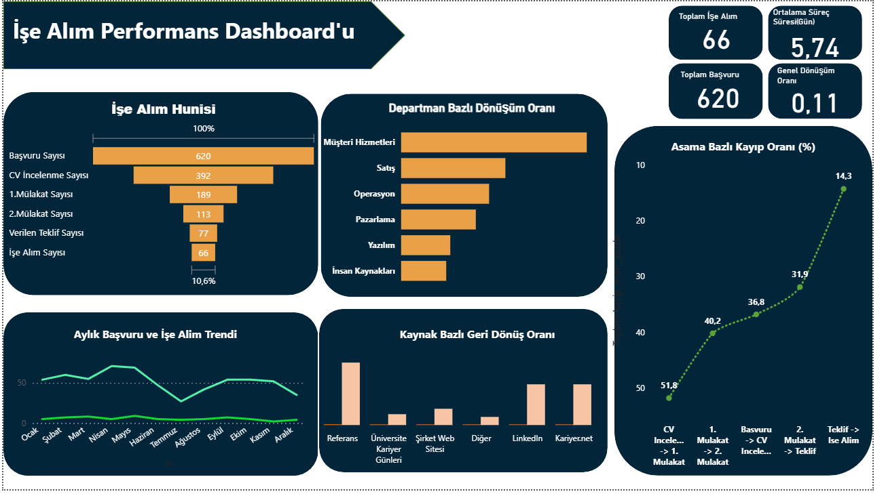

# İşe Alım Performans Dashboard'u

Bir şirketin işe alım sürecini uçtan uca (başvurudan işe alıma) analiz eden, huninin hangi aşamasında darboğaz yaşandığını ortaya koyan bir veri analitiği projesi.

## Proje Amacı

İK ekiplerinin en sık sorduğu sorulardan yola çıkıldı: *Hangi departmanlarda işe alım süreci daha verimli? Hangi başvuru kaynağı daha başarılı adaylar getiriyor? Sürecin neresinde en çok aday kaybediliyor?*

Bu sorulara veriyle cevap vermek için başvurudan işe alıma kadar olan süreç uçtan uca modellendi ve görselleştirildi.

## Kullanılan Araçlar

- **Microsoft SQL Server / SSMS** — veri modelleme ve analiz sorguları
- **Power BI** — interaktif dashboard ve görselleştirme

## Veri Seti

Gerçek bir şirket verisine erişim olmadığı için, gerçekçi bir işe alım hunisi verisi sentetik olarak oluşturuldu.

- **620 başvuru**, 1 yıllık dönem (Temmuz 2025 – Haziran 2026)
- **6 departman**: Yazılım, Satış, Müşteri Hizmetleri, Pazarlama, Operasyon, İnsan Kaynakları
- **6 başvuru kaynağı**: LinkedIn, Kariyer.net, Referans, Şirket Web Sitesi, Üniversite Kariyer Günleri, Diğer
- **6 huni aşaması**: Başvuru → CV İncelemesi → 1. Mülakat → 2. Mülakat → Teklif → İşe Alım

Veri, departman ve kaynak bazlı farklı geçiş olasılıkları kullanılarak gerçekçi bir dağılım oluşturacak şekilde tasarlanmıştır.

## Analiz Süreci

1. Sentetik `recruitment_funnel.csv` verisi SQL Server'a aktarıldı
2. Aktarılan veri üzerinde huni özeti, departman/kaynak bazlı dönüşüm oranları, süreç süreleri ve aşama bazlı kayıp oranlarını hesaplayan sorgular yazıldı (`SQLQuery1.sql`)
3. Power BI'da SQL Server'a canlı bağlantı kurularak interaktif bir dashboard oluşturuldu

## Temel Bulgular

- **Genel dönüşüm oranı %10,6** — 620 başvurudan 66 kişi işe alındı
- **Departman bazlı en yüksek dönüşüm Müşteri Hizmetleri'nde (%21,1)**, en düşük Yazılım'da (%5,6)
- **Referans en başarılı başvuru kaynağı (%28)** — LinkedIn ve Kariyer.net'in yaklaşık 3 katı başarı oranına sahip
- **En büyük darboğaz CV İncelemesi → 1. Mülakat aşamasında (%51,8 kayıp)** — sürecin bu adımı gözden geçirilmeli
- İşe alınan adaylar için **ortalama süreç süresi 5,74 gün**

## Dashboard Görünümü

Dashboard; toplam başvuru, toplam işe alım, genel dönüşüm oranı ve ortalama süreç süresini gösteren KPI kartları, işe alım hunisi, departman ve kaynak bazlı dönüşüm grafikleri, aylık başvuru/işe alım trendi ve aşama bazlı kayıp oranı grafiğinden oluşuyor.

## Dosyalar

| Dosya | Açıklama |
|---|---|
| `recruitment_funnel.csv` | Sentetik ham veri |
| `SQLQuery1.sql` | Analiz sorguları |
| `ise_alim_dashboard.pbix` | Power BI dashboard dosyası |
| `dashboard_screenshot.png` | Dashboard ekran görüntüsü |

## Not

Bu projedeki veriler gerçek bir şirkete ait değildir; analiz ve raporlama becerilerini göstermek amacıyla sentetik olarak üretilmiştir.
